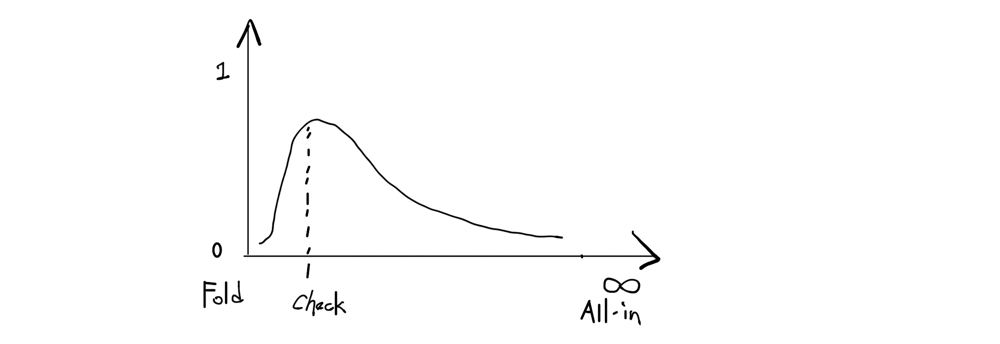
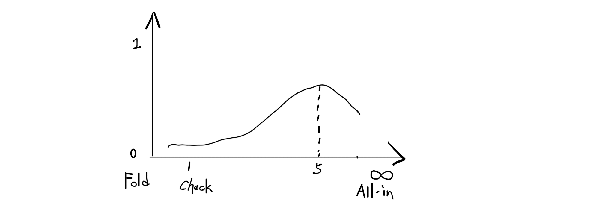
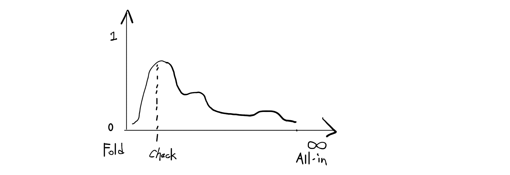
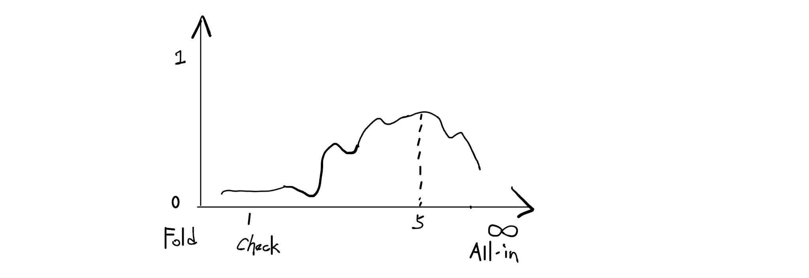
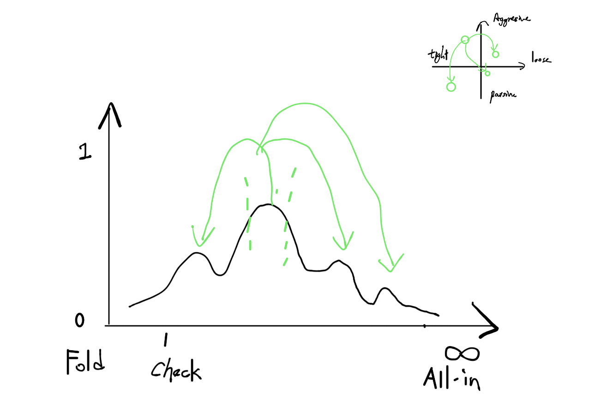

# Texas Hold'em AI 🤖
CS Independent Study @UVa

Overview
--------
This is an independent study on the application of current machine learning techniques into Texas Hold’em AI.

Update Timeline
---------------
**Topic: Pre-flop Decisions.**

When we play the poker game as human, the pre-flop situation emotionally and strategically determines how we play the whole round of game. As the beginning stage of the machine prediction, more accurate and simplified calculation at this stage might be helpful to foresee or narrow the result of the entire game.

Rules require strategy of different complexity:

- Kuhn poker
- Leduc Hold’em
- No-limit Hold’em
- Limit Hold'em / Cash game

Three important stages to consider:

- When cards are dealed
    - David Sklansky’s table
    - Expected Hand Strength (EHS)
- When it’s your turn to bet
    - Limp / Raise / Fold decision
    - Stake/blind ratio and Jam/Fold strategy
- When everyone finishes his/her actions
    - Possible range of everyone’s hand

********

**October 2nd update**

**Winning Strategy on Three-cards Game for a Python Bot**

1. Rules of the three-cards game:

	- Only three cards with no suits: Q, K, A (from lowest to highest).
	- Two players each pay one unit bet as blinds.
	- The first player can make a bet of 1 unit or fold to lose the blind; The second player can only call/fold.
	- If the second player calls, compare their cards to determine the winner.

2. Optimal Strategies for a bot ([PokerBot.py](PokerBot.py)):

    - To use this PokerBot: `from PokerBot import decision`.
    - Inputs
        - `isFirst`: `True` if the bot plays first, or `False` if it plays later.
        - `hand`: integer, `0` = Q, `1` = K, `2` = A.
    - Output
        - `True` if the bot plays aggressively (bet/call), or `False` if the bot chooses to fold.
	- Strategies as the first player:
		- Get an A (Must bet).
		- Get an K (`PROB_K_BET` = 1, see (4) below).
		- Get an Q (Bluff with probability `PROB_Q_BET`, see (3) below).
	- Strategies as the second player:
		- Get an A (Must call).
		- Get an K (Optimal strategy depends on `PROB_Q_BET`).
		- Get an Q (Must fold).

3. `PROB_Q_BET`: probability that a first player holding a Q makes a bluff:

    - Consider a second player holding a king:
        - Probability that he is facing an ace = 0.5.
        - Probability that he is facing a bluffing queen = 0.5p.
        - Optimal strategy: to call with probability = p/(1+p).
    - Let p = `PROB_Q_BET`. we want to maximize the expression:  
    
    
    - Optimal solution for `PROB_Q_BET`:  
    
    
    - Decision Tree:      
	

4. `PROB_K_BET`: probability that a first player holding a K should bet:

    - Let q = `PROB_K_BET`. we want to maximize the expression: f(q) = 0.5q - 1.
    - Optimal solution for `PROB_K_BET`:  q = 1.
    
    - Decision Tree:     
    


********

**September 22th update**

**Model on Simplified Game**

1. Rules of simplified game:

	- Only five cards with no suits: T, J, Q, K, A (from lowest to highest).
	- Two players each pay 1/2 pot as blinds.
	- First player makes a bet of certain sizes; second player can only call/fold.
	- If the second player calls, both show cards to determine the winner.

2. Rational analysis:

	- Winning chance: A - 100%, K - 75%, Q - 50%, J - 25%, T - 0%.
	- Bet size analysis: if first player has K, and he makes a 1/2-pot bet:

		- The second player needs 1/2 pot to call; he has already invested 1/2 pot.
		- So if his hand has a winning chance greater than 50%, he should call; otherwise he should fold.
		- If his winning chance is exactly 50%, he has equal possibility to call/fold.
		- If the second player has A (25% chance), he must call. If he has Q, he either calls or folds with 50% chance each. If he has J or T, he should fold.
		- First player's expected pay-back at 1/2 pot bet: 0.25\*(-1) + 0.125\*1 + 0.625\*0.5 = 0.1875 pot.

	- Pseudocode for bet-size vs. expected pay-back:
	```
	cards = [T, J, Q, K, A]
	chance = { T: 0, J: 0.25, Q: 0.5, K: 0.75, A: 1 }

	EVALUATE_PAYBACK(betsize, current_card)
		expect = 0
		limit = 1 / (2 * betsize + 1)
		FOR card IN cards \ current_card
			IF chance[card] > limit
				IF card > current_card
					expect += 0.25 * (0.5 + betsize)
				ELSE
					expect += 0.25 * (-0.5 - betsize)
			ELSE IF chance[card] == limit
				IF card > current_card
					expect += 0.125 * (0.5 + betsize) + 0.125 * 0.5
				ELSE
					expect += 0.125 * (-0.5 - betsize) + 0.125 * 0.5
			ELSE
				expect += 0.25 * 0.5
			END IF
		END FOR
		RETURN expect

	MAIN()
		FOR card IN cards
			FOR x = 0 to max_bet
				expect = EVALUATE_PAYBACK(x, card)
				PLOT(x, expect)
			END FOR
		END FOR
	```

3. Training by self-play:

	- First player plays randomly; second player plays rationally.
	- Gather output (x, actual payback) and regress.
	- Improve the curve in step 2 with additional randomness.

********

**September 15th update**

**Randomness in Training**

1. Probabilistic trend prediction
    - Based on results from rational neural network
    - For each input, output a probabilistic distribution of bet sizes
    - Example: In preflop, probabilistic distribution trend of 2,7 (Fig. 1)
vs. distribution of A,A (Fig. 2) 

2. Empirical data training
    - Regression on probabilistic trend distribution described above
    - Train artful neural network to add noise to the curve
    - Example: distribution of 2,7 after regression (Fig. 3)
 vs. distribution of A,A after regression (Fig. 4) 

3. Randomness in betting consistency
    - Use randomness to "explore" around the distribution curve
    - Indeterministic betting strategies without predictable patterns(aggresive/passive, tight/loose clustering)
    - Example: how randomness "explores" around distribution curve, in the situation for 2,7 in preflop, say 5,7,K in flop. Indeterministic playing pattern exists in changing to another local maxima   (Fig. 5)

********

**September 8th update**

**Focusing on first time bet decisions**

- Rational Neural Network
    - logic based on probability & nash equilibrium
    - data derived from rigorous calculation ([EHS](https://en.wikipedia.org/wiki/Poker_Effective_Hand_Strength_(EHS)_algorithm/))
    - regression between hand strengths and bet sizes

- Artful Neural Network
    - logic based on professional strategies
    - from real world data
    - deep learning (???)

- Input
	- previous opponent bet size
	- pocket hand strength

- Output
	- randomness(could be a normal ditribution)
	- opoenent hand strength
	- bet size
	- consistent strategies	 in rest of game


Milestones
----------
1. Learn different machine learning techniques and decide the specify aspect our research project will focus on.

2. Look for the proper dataset to train the netrual network and compare the results of different training methodology.

3. Integrate the project API into current AI bot and finish the research paper.

Datasets
--------
- Standardization
    - pot size
    - player level
- Remove possible error
    - unreasonable plays
- Additional information
    - player waiting time
    - ...

Resources
---------
- Machine Learning
    - Framework
    - Relavant Reports
        - *End of Code* by [Wired](http://www.wired.com/2016/05/the-end-of-code/)
        - *Why Randomness is Important for Deep Learning* [Link](http://blog.evjang.com/2016/07/randomness-deep-learning.html)
    - Book
    	- *Neural Networks and Deep Learning* [Link](http://neuralnetworksanddeeplearning.com)
    - Research Paper
	    - *Deep Reinforcement Learning from Self-Play in Imperfect-Information Games* [PDF](http://arxiv.org/pdf/1603.01121v2.pdf)
	    - *Mastering the Game of Go with Deep Neural Networks and Tree Search* [PDF](https://gogameguru.com/i/2016/03/deepmind-mastering-go.pdf)
- Game Theory
	- *prisoner dilemma game* [Link](http://cs.stanford.edu/people/eroberts/courses/soco/projects/1998-99/game-theory/index.html)
- Behavior Theory
- Poker Strategy
    - the Poker Bank [link](http://www.thepokerbank.com)
- Related Course
    - [CS6501 Poker](http://www.cs.virginia.edu/evans/poker/)
    - AI Strategies for Solving Poker Texas Hold'em [Slides](http://www.slideshare.net/GiovanniMurru/ai-strategies-for-solving-poker-texas-holdem)
- Research Paper
    - [Claudico Overview](http://reports-archive.adm.cs.cmu.edu/anon/anon/home/ftp/2015/CMU-CS-15-104.pdf)


Setup
-----

- Sep. 3rd Project Setup
    - github init


Acknowledge
-----------

Thanks Prof. David Evans for the instructions and supports.


Contact Us
----------

- Current Collaborators
    - Charlie Wu [jw7jb@virginia.edu](mailto:jw7jb@virginia.edu)
    - Tong Qiu [tq7bw@virginia.edu](mailto:tq7bw@virginia.edu)
